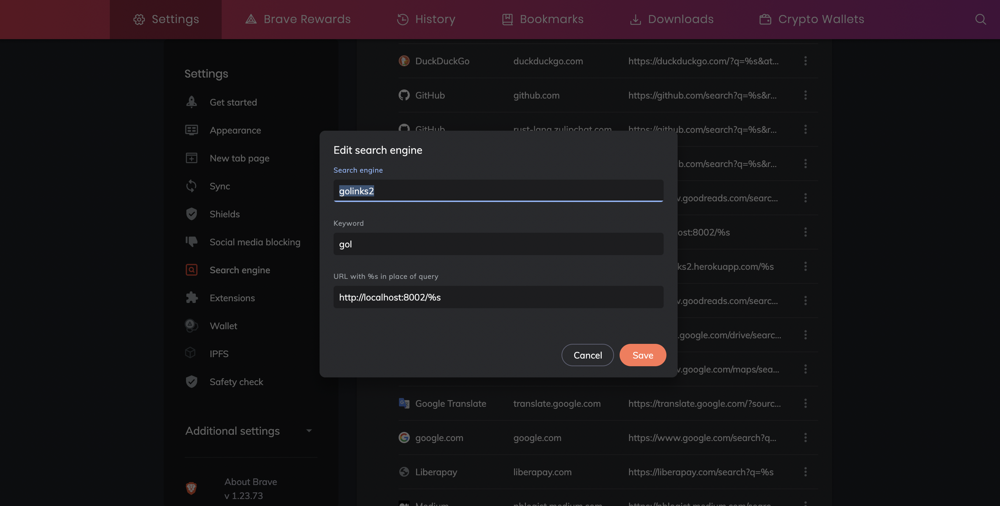
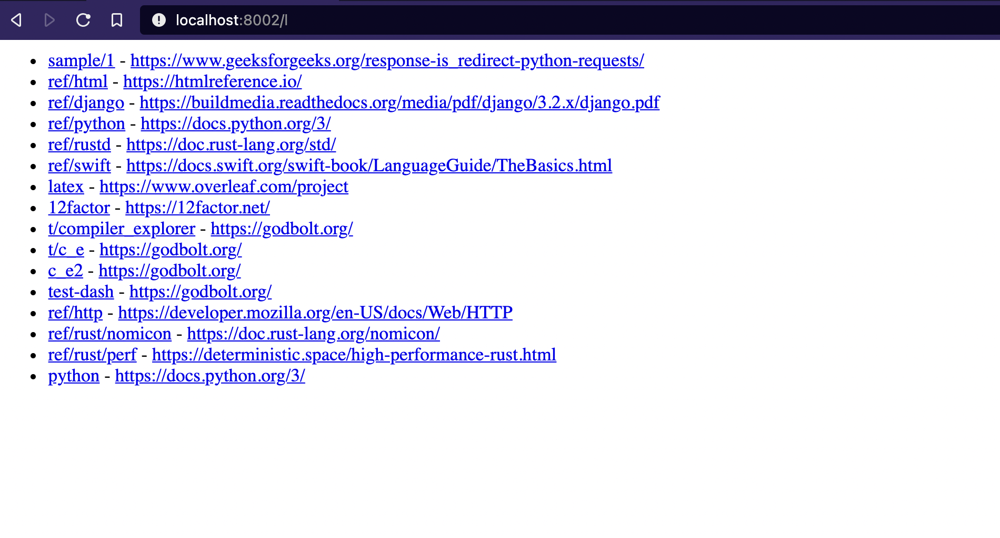
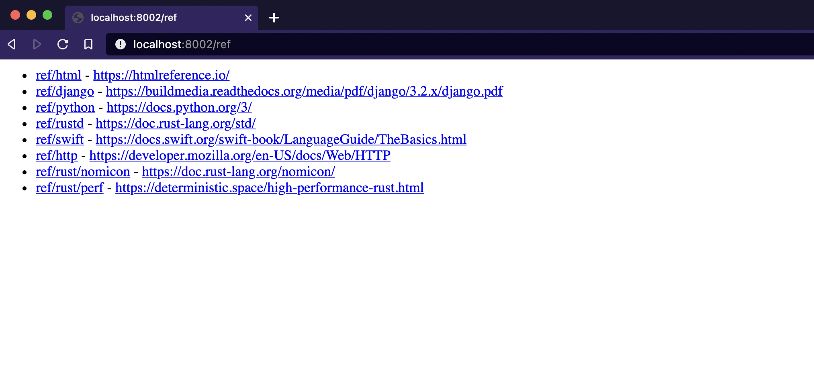

# Golinks2

I love the [golinks](https://github.com/GoLinks/golinks) project and thought that it's a decent project idea to implement while serving as a playground to learn django and other tech. The desired feature set is:
- ✅  ability to save links
- ✅  redirect to a link. 
- ✅  list the links. 
- search through the available - use webassembly and rust for the search feature. 
- ✅  have ability to specify the paths as aliases : `cs/papers/kafka` etc.
- ✅  list subdirectories (for example, when you do `go/ref`). 
- edit and delete url. 
- ✅  authenticated logins. 
- have the bookmarks associated with each user.
- ✅ heirarchy of bookmarks

## More ideas:
- add logging framework
- sharing the bookmarks or having user groups
- containerize the application
- It can also be extended to have a personal toolkit - `t/` is the toolkit subdomain, wherein the subdomains open in an embedded webview. For example: `t/epoch` takes you to the eopchconverter website in an embedded view. Hence, a "toolkit"
- beautify the interface
- setup CI/CD (unit tests) only for the repo
- record search result performance (what rank search result is being selected?)
- use webassembly when introducing search
- performance tests

## usage
- golinks2 serves only authenticated users and you can create a superuser to login using python's manage.py.
- you can use gunicorn to run a local server: `gunicorn wsgi.py`. You can also just use django's manage.py
For gunicorn, the above command launches on port 8000 by default, you can set `PORT` environment variable for something different.
- For convenience, you should add a search engine shortcut, so if you do something like `go/` and press tab, it'll activate golinks2 search. 

- you can then start adding bookmarks. For example, add the python documentation under `go/python` 

Once added, you can goto the python reference using `go/python` 

- you can list the aliases using `go/l`

- golinks2 supports directlory like structure for the aliases. For example, you might organise all references under `go/ref` and list them:

---
doubts:
- concurrency scenario in django - how are long running tasks handled? Does it block the further API use?
